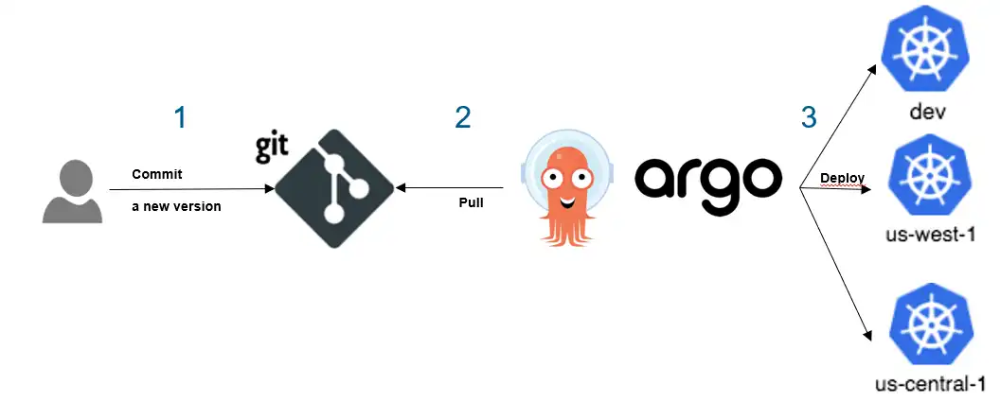
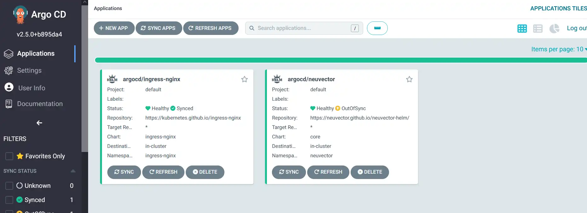
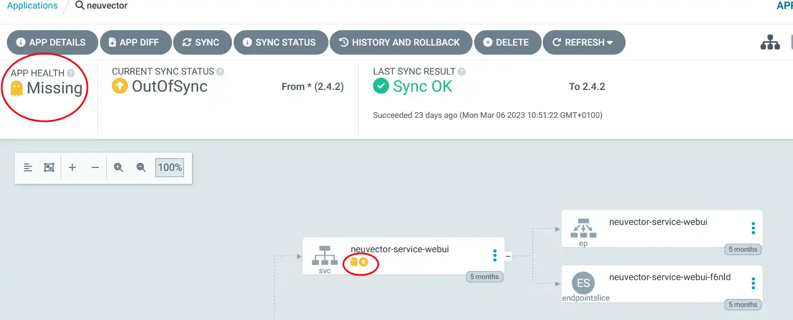
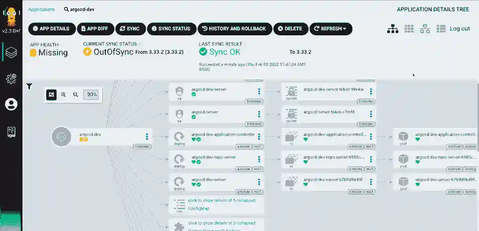

# ArgoCD


## Version courte

[ArgoCD](https://argoproj.github.io/) est un outil GitOps qui se spécialise dans le déploiement dans Kubernetes.


L'intérêt du gitops par rapport au déploiement pipeline classique, c'est qu'il s'assure d'avoir une cohérence entre la source de vérité (le git) et ce qui tourne réellement dans votre environnement. 


Prenons quelques exemples concrets de son utilisation :
- Si je fais un changement manuel sur mon environnement de prod, argocd va afficher les déviations et vous proposer de les corriger.
- Si je veux déployer une nouvelle version de mon application, je modifie mon référentiel (git par exemple) et je demande à ArgoCD de déployer ma nouvelle version.
- Je me rends compte que la nouvelle version comporte un bug, je peux revenir à une version précédente facilement via l'interface.

Ce type d'outil fonctionne à merveille avec un outil comme [renovate](https://github.com/renovatebot/renovate) qui va mettre automatique à jour vos repository git.

## Version longue

### Déploiement Continu

Il existe un grand nombre d'outils pour faire du déploiement continu, la [landscape de la CD foundation](https://landscape.cd.foundation/) permet d'avoir une vue globale.
[ArgoCD](https://argoproj.github.io/) est un outil qui se spécialise dans le déploiement dans Kubernetes.

Il vient récemment de passer au niveau maximum de maturité (Graduated) dans la CNCF, ce qui implique :

- un audit de sécurité indépendant
- des contributeurs venant de plusieurs organisations
- un processus de versioning et de patch de failles de sécurité
- un nombre suffisant de contributeurs et de commit
- un usage en production chez 3 clients indépendants

C'est aussi le cas de [Flux](https://fluxcd.io/) (son principal concurrent) que je présenterais dans un prochain article.

### L'approche GitOps


Le [projet Open GitOps](https://opengitops.dev/) définit le GitOps selon 4 axes principaux :

1. Declarative: Le système (en GitOps) doit décrire l'état cible de manière déclarative.
2. Versioned and Immutable: L'état souhaité doit être stocké de manière versionnée, immuable et contenir l'intégralité de l'historique.
3. Automatically Pulled: Les agents doivent récupérer l'état souhaité depuis la source.
4. Continuously Reconciled: Les agents doivent détecter les changements entre l'état désiré du système et l'état réel du système.
   

Prenons un exemple avec ArgoCD et un déploiement dans Kubernetes :

1. Declarative: Je crée les fichiers yaml (ou le helm chart) qui décrivent mon application dans Kubernetes pour mon environnement de qualif.
2. Versioned and Immutable: Je stocke ces fichiers dans une repository git (GitLab ou GitHub) et je crée des tags pour mes différentes versions.
3. Automatically Pulled: L'agent ArgoCD va scruter toutes les deux minutes (par défaut) mon repository git pour détecter un changement
4. Continuously Reconciled: L'agent ArgoCD va comparer l'état souhaité de mon environnement avec l'état réel dans le cluster Kubernetes et appliquer automatiquement ou non le changement.

### Installation

ArgoCD se déploie uniquement dans un cluster **Kubernetes**.
Il possède deux modes d'installation pour la disponibilité :

- un mode simple pour des tests ou un usage en dev
- un mode haute disponibilité pour un usage en production.

Et il peut se déployer deux manières pour les permissions :

- Avec des droits complets sur le cluster Kubernetes pour déployer partout dans le cluster.
- Avec des droits limités sur un seul namespace.

Dans mon cas, je vais le déployer en mode simple et avec les droits complets sur le cluster.

```bash
kubectl create namespace argocd
kubectl apply -n argocd -f https://raw.githubusercontent.com/argoproj/argo-cd/stable/manifests/install.yaml
```

### Fonctionnement



ArgoCD va donc régulièrement aller vérifier dans le référentiel s'il y a des changements et les appliquer automatiquement (ou manuellement selon votre configuration).

ArgoCD va aussi vérifier régulièrement que ce qui tourne dans Kubernetes correspond bien à l'état souhaité.

### Fonctionnalités

Voici quelques captures d'écran :

- Dans cet exemple, on voit la liste des projets déployés dans mon cluster Kubernetes.



- Dans cette exemple, on voit qu'une partie de mon application est "Missing" et quand je regarde sur le graphique, je vois que le service neuvector-service-webui a disparu.




- Dans l'exemple suivant, on resynchronise une application qui a dérivée.



### Fonctionnalités avancées

- **Multicluster:** ArgoCD peut déployer dans le Kubernetes local ou des Kubernetes distants, il est donc possible de déployer la même application dans plusieurs clusters.
- **Utilisateur:** ArgoCD gère sa propre base d'accès, il est possible de définir quel utilisateur a accès à quel projet.
- **Accès au Terminal des pods:** Il est possible d'accéder au terminal d'un pod via l'interface Web.
- **Gestion des version:** Il est possible de définir Argo pour qu'il utilise la dernière version disponible, pratique sur les outils gérés par des éditeurs tiers.
- **Notification:** ArgoCD implémente un moyen de notifier l'utilisateur en cas de changement via Stack, Teams, Mail, ...
- **Fenetre de synchro:** Il est possible de dire à argoCD de ne faire de mise à jour que sur des créneaux horaires précis (durant les heures de boulot par exemple)
- **Exclusion:** Il est possible d'exclure une partie des descripteurs yaml de l'application, si elle contient des données aléatoires ou si un autre processus la modifie par exemple.

### Quelques inconvénients

Cette approche nécessite d'avoir un bon niveau de maturité dans sa phase de déploiement, tout doit être dans Git et si possible avec des helm chart (l'équivalent d'un package pour Kubernetes).

Le mode réconciliation automatique permet de s'assurer d'avoir une synchronisation entre le référentiel et l'environnement cible mais il faut la aussi être très rigoureux, c'est par exemple idéal pour la dev mais pour la production il peut être plus judicieux de commencer avec une réconciliation manuelle.

L'outil fournit une nouvelle surface d'attaque pour votre cluster, en effet selon votre mode d'installation, une faille dans argoCD permettrait à un attaquant de déployer dans votre cluster.

### Conclusion

ArgoCD est un des outils qui permet de faire du GitOPS pour Kubernetes, mais ce n'est pas le seul Flux est aussi très mature dans ce domaine.

J'espère vous avoir convaincu de l'intérêt d'une telle solution, c'est une cible vers laquelle il faut tendre.

Mais cette solution nécessite un bon niveau de maturité et d'automatisation pour en tirer vraiment avantage.
