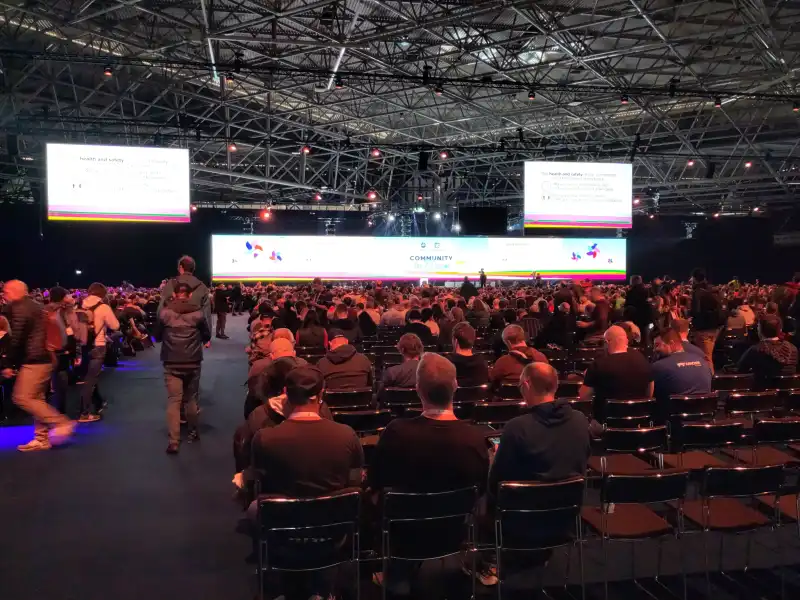
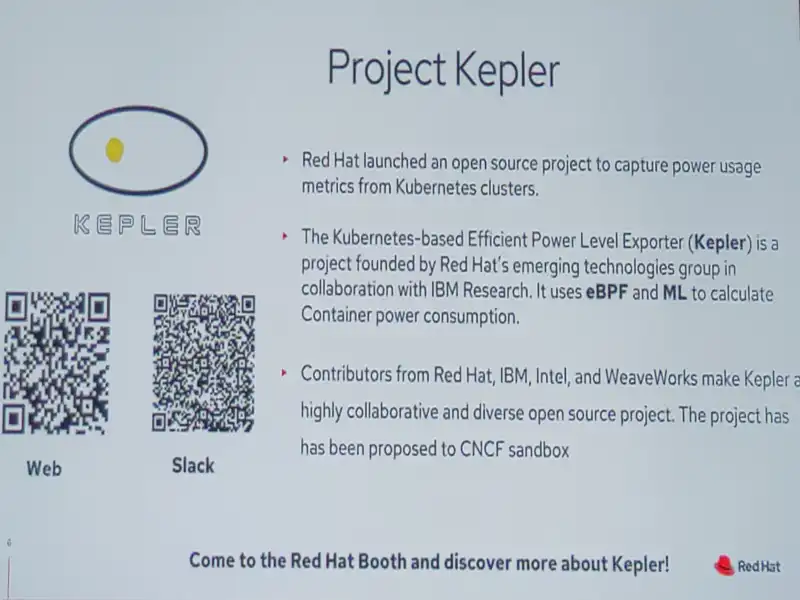
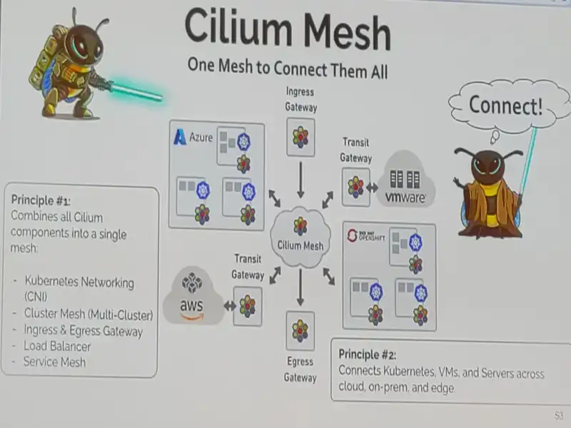
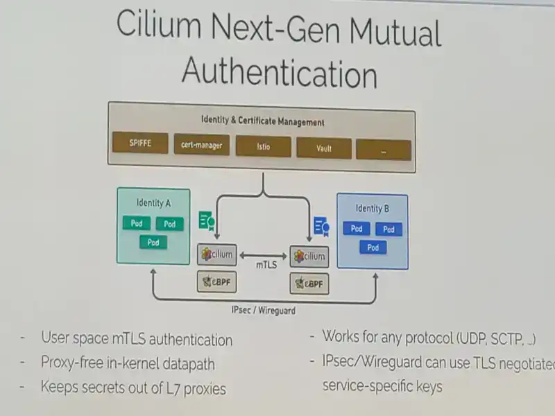

# KubeCon Europe 2023

Je vais mettre cette article à jour au fur et à mesure des talks.

## Day 1

### Keynotes

La première vidéo commence par une présentation de la CEO qui n'est pas présente et qui nous montre la facilité d'utiliser kubernetes sur son poste avec [kind](https://kind.sigs.k8s.io/).

La première annonce concerne l'emplacement de **la prochaine KubeConEU (en 2024) qui se passera à Paris, cocorico.**

Kubernetes a été récemment audité sur la version 1.24 et le résultat est positif pour plus de détail, le pdf est sur [github](https://github.com/kubernetes/sig-security/blob/main/sig-security-external-audit/security-audit-2021-2022/findings/Kubernetes%20v1.24%20Final%20Report.pdf)

Le Glossaire de la cncf continue de grandir et il est toujours aussi utile [https://glossary.cncf.io](https://glossary.cncf.io)

La cncf annonce aussi une newsletter pour se tenir au courant des nouveautés : [Wisdom of the cloud](https://www.cncf.io/enduser/wisdom-of-the-cloud/)

Puis Red Hat présente l'outil [Kepler (Kubernetes Efficient Power Level Exporter)](https://github.com/sustainable-computing-io/kepler) qui a comme objectif de mesurer la consommation electrique des pods dans Kubernetes, le projet est pour le moment plutôt jeune.

La [Green Software Foundation](https://greensoftware.foundation/) propose [une liste des logiciels existants](https://github.com/Green-Software-Foundation/awesome-green-software) dans ce domaine et il propose aussi des spécifications, guidelines, etc...

Pour finir une présentation de [KEDA](https://github.com/kedacore/keda) et de la possibilité de faire de l'autoscaling basée sur la consommation carbone.

### Talk: Argocd core

Une présentation de la partie core de argo, il est possible d'installer argoCD en version simplifiée avec un minimum de fonctionnalité (pas d'interface WEB, pas de multitenancy, pas d'API).

On commence donc à rapprocher de la philosophie de flux.

Pour l'installer, il suffit d'installer [ces manifests](https://github.com/argoproj/argo-cd/blob/master/manifests/core-install.yaml) et d'utiliser le CLI argo.

Il est possible de démarrer une admin web sur notre poste pour avoir un accès plus facile, sinon tout est accessible via la CLI d'argo.

### Talk: From SBOM To IBOM

Une conférence intéressante sur la nécessité d'avoir les informations sur son infrastructure et pas uniquement les SBOMS des applications.

Les IBOM (Infrastructure Build Of Material) doivent contenir tout ce qui est necessaire pour comprendre l'infrastructure et detecter les vulnérabilités (version des modules terraform, version des services mananagés , version des outils). 
L'idée est de dire que si une faille apparait dans un des services ou des composants utilisés (une version de Kubernetes avec une faille de sécurité), il faut être capable de trouver quelle sont les applications qui l'utilise.

Le speaker précise clairement que la CMDB existe pour celà depuis longtemps et qu'elle est de plus en plus nécessaire avec l'utilisation des hyperscalers car il y a de plus en plus de versions managées et d'applications en SaaS.

### Verifiable Github action with eBPF

Cette présentation nous explique l'utilisation de [tracee-action](https://github.com/aquasecurity/tracee-action) pour vérifier que nos github actions n'ont pas été compromise.

Il se base sur:
- les profile pour apprendre ce que fait la github actions et bloquer les actions qui ne correspondent pas au profil.
- les signatures pour detecter du crypto mining, des Ip étranges etc...

Il utilise eBPF pour faire ces actions et se concentre principalement sur les executions, les fichiers modifiés et les appels réseau.

On est donc capable de detecter un fonctionnement étrange dans notre pipeline avec cette outil, il rajoute par contre un peu de travail pour générer le profil et le mettre à jour régulièrement.

### Cilium

C'est une présentation rapide de cilium et de sa future roadmap.

Cilium est un servicemesh qui est composé de:
- Cilium CNI: un Container Network Interface, c'est le coeur du projet.
- Cilium Service Mesh: Le serviceMesh et Ingress
- Humble: L'observabilité réseau
- Tetragon: la sécurité basé sur l'observabilité.

La roadmap annonce:
- un support du mtls de manière native via les network policy 
- une meilleure intégration de SPIFFE
- une meilleure gestion des Days2 actions
- Le Cilium Mesh qui permet d'interconnecter des machines et des pods via une vm à déployer (qui fait office de routeur)

## Day 2

### Keynotes

Pas de grosse annonce ou de chose très importantes dans la keynote du deuxième jour, hormis :
- Keycloak a rejoint la cncf 
- un nouveau Working group a été créé autour de WASM

### ArgoCD ChaosEngineering

Un talk très intéressant qui présente des fonctionnalités secrètes de ArgoCD pour faire du chaosengineering.

En préambule, on nous prévient que des fonctionnalités secrètes dans les outils opensource ca veut dire non documentés, dans notre cas elles sont dans le dossier [hack](https://github.com/argoproj/argo-cd/tree/master/hack)

Dans ce dossier hack, nous allons utiliser la fonctionnalité gen, avec cette demo :
- Il génère un ou plusieurs [vcluster](https://github.com/loft-sh/vcluster), ce sont des clusters kube contenu dans kubernetes lui même, il y en a un par namespace.
- Il génère un grand nombre d'application et les modifie régulièrement pour tester la réconcialiation. (1250 dans la démo)
- Ce tests va donc consommer un grand nombre de ressources en fonction de vos paramètres (cpu et RAM) pour executer ce test. ()
- Nous allons donc solliciter argoCD intensivement pour vérifier la stabilité d'argo et ses performances.

Après un sondage rapide, plusieurs utilisateurs ont plus de 2 000 applications dans une seule instance d'argoCD, le gagnant en a 5430.

### GitOps Tips

- Deploy PR on preview environment.
- Wave deployment avec argo Workflow syncWave ?
- argoCD post hook pour faire des tests mais il font pas partie du state:
  - tester le status en dehors d'argo
  - stocker le resultat des tests dans une annotation
  -
-
