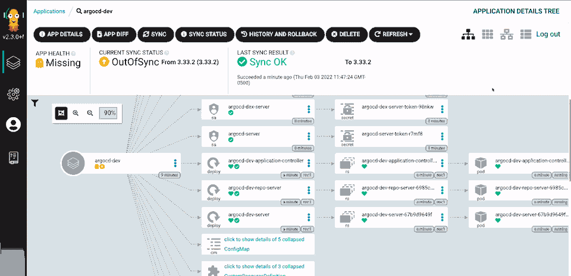

## Minimalisme

Dans un objectif de minimalisme, j'essaye de garder ce blog le plus petit possible, mon serveur le vit bien et la bande passante de mes utilisateurs aussi.  
J'ai donc besoin d'optimiser la taille des images, le reste (js, font, ...) l'ai déjà. 

## La taille des images

Sans surprise une image en svg est-ce qu'il y a de plus efficace, mais ce n'est pas toujours possible j'ai souvent tendance à faire des captures d'écran ou de récupérer des images sur le net.

Les image de type .webp sont les plus efficaces en taille dans ce cas-là, il est possible de les utiliser pour des images statiques (jpg, png) ou pour des images dynamiques (type gif).

## Transformer une image statique en webp

Pour cela, il existe plusieurs méthodes la plus simple pour moi est d'utiliser l'outil en ligne de commande [cwebp](https://developers.google.com/speed/webp/docs/cwebp?hl=fr)

Sous Ubuntu, il me suffit de faire : 
```bash
sudo apt install webp
```

Ensuite, il suffit de choisir l'image et de choisir la qualité entre 0 et 100, ici,  je vais prendre 50.
Il est possible de transformer des images de type jpeg, png, tiff ou wepb.


Pour exemple, pour optimiser une image déjà en webp.
```bash
cwebp -q 50 argowrong.webp -o argowrong2.webp
```

Sur cet example, je suis passé d'une image de 248k à 28k.

Il est bien sûr possible de faire la même chose sur une image png.

```bash
cwebp -q 50 argo.png -o argo.webp
```

Dans cet example, je suis passé de 64k à 28k sans trop perdre en qualité, il faut bien sûr adapter le paramétre qualité en fonction de vos besoins.


## Transformer une image dynamique en webp

Il est possible de faire la même chose avec une image au format gif mais avec l'outil **gif2webp** qui appartient au même projet.

Je vais prendre comme départ l'image gif d'argocd dans mon post précédent [le gif d'argo](https://github.com/argoproj/argo-cd/blob/43b728bda9999db428efe6ca100cda1a5014caf4/docs/assets/argocd-ui.gif), cette image pèse 3 Mo et donc je voulais l'optimiser.

Naivement, j'ai suivi la même procédure qu'avant :

```bash
gif2webp -q 50 argocd-ui.gif -o argocd-ui.webp
```

Et je suis passé d'une image de 3Mo à 2,7Mo, bon c'est mieux mais c'est pas vraiment ce que j'espérais.


## Modifier une image gif

Pour cela, j'ai découvert l'outil gifsicle, qui permet de modifier beaucoup de chose dans les images gif.

Pour l'installer:
```bash
sudo apt install gifsicle
```

Puis je tente une optimisation simple:
```bash
gifsicle argocd-ui.gif  -O3 -o test.gif
```

Après vérification, aucun changement de taille significatif.

Je vais donc dégrader un peu l'image, je vais réduire significativement le nombre de couleurs:

```bash
gifsicle -i argocd-ui.gif -O3 --colors 16 -o test.gif
```

Bon l'image fait 443k, elle est nettement moins joli mais c'est un blog technique pas un blog d'art donc ça me convient.

Je regarde en détail, le contenu de l'image via:
```bash
gifsicle -I argocd-ui.gif 
```

Et je me rends compte qu'il y a 158 images avec un délai de 0,04s entre chaque, je vais donc en garder un quart.

```bash
gifsicle -U  argocd-ui.gif $(seq -f "#%g" 0 4 158) -O3 --colors 12  -o test.gif
```

Je change le delai de 0,04s à 0,20s pour garder la même vitesse:
```bash
gifsicle -b -d 20 test.gif
```

Je me retrouve maintenant avec une image qui fait 224k, je la transforme en webp

```bash
gif2webp -q 50 test.gif -o argocd-ui.webp
```

Mon image finale fait 192ko (la taille initiale était de 3Mo)

## Images finales

- L'image originale 248K

- L'image réduite 28K


Dans ce premier cas d'usage, franchement, c'est bluffant, je ne vois que très peu la différence.

- l'image Gif original 3Mo


- L'image webp réduite 192k



Dans ce cas ci par contre on voit bien que le jeu de couleur est dégradé, mais bon l'image a été réduite par plus de 15.


## Conclusion

Il est plutot facile d'optimiser ses images, je pense que je ferai l'effort d'utiliser ces outils plus souvent, powerpoint par exemple supporte le webp statique.
