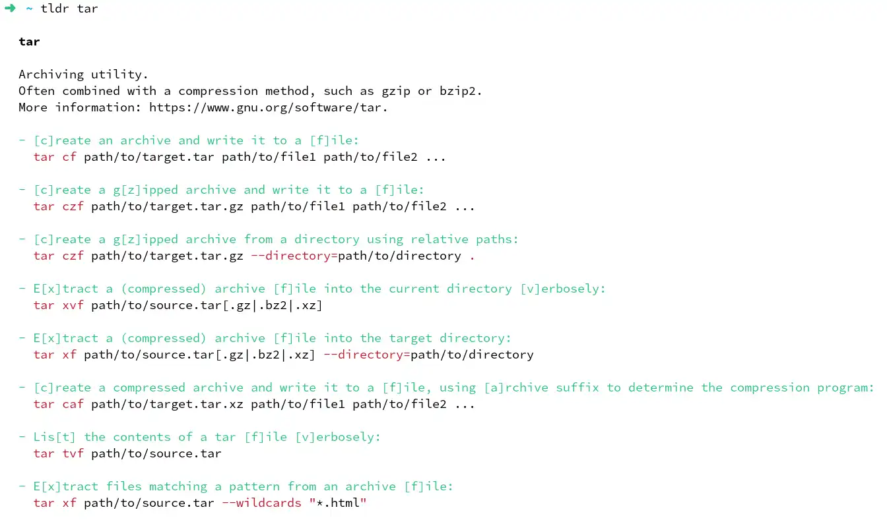

## TLDR

It is very common for programmers to tweak and customize their tools for hours, add or write new plug-ins, all in pursuit of the “perfect environment” and an increase of productivity.  
On the other hand, others prefers to keep the tool intact in order to change easily.

I prefer the first solution, moreover I use a lot the terminal in my life for multiple reasons IMHO (efficiency, durability , productivity, ...), so i decide to tweak it.

Recent shells add a lot of features for the quality of life like:
- autosuggestions, improved autocompletion, synthax highlighting
- Modern Design (icons, colors)
- And new tools like Fuzzy finder, clever change directory 

In order to upgrade your terminal, you need to follow these steps:
- Choose a recent terminal (Windows terminal or alacritty for example)
- Install font on your main OS (Windows for WSL)
- Install zsh
- Install powerlevel10k
- Replace your old utils with the new one (fzf, bat, ...)


## How To with detail

### Choose your shell

In order to use all the new features of the terminal, you need to switch to a new shell like fish or zsh.

The fish and zsh shell are both great, fish works out of the box and zsh has a lot of plugins.

I will use zsh for this article.

```bash
sudo apt install zsh
chsh -s /bin/zsh
```

### Use an up-to-date terminal

Another important topic is to use a modern terminal in order to display new icon.

- For Windows, I use [Windows terminal](https://github.com/microsoft/terminal)
- For Linux, I use [Alacritty](https://github.com/alacritty/alacritty)

### Install Eget 

[Eget](https://github.com/zyedidia/eget/releases) is a tool used to download binary from GitHub release.  
I will advise multiple tools and eget will help to download it and to keep them up to date.

So please install it and add it to your PATH.

```bash
curl -OL https://github.com/zyedidia/eget/releases/download/v1.3.3/eget-1.3.3-linux_amd64.tar.gz
mkdir -p ~/.local/bin
echo 'PATH=~/.local/bin/:$PATH' >> ~/.zshrc
tar -xzf eget-1.3.3-linux_amd64.tar.gz --strip-components 1  -C .local/bin eget-1.3.3-linux_amd64/eget-1
rm eget-1.3.3-linux_amd64.tar.gz
echo "[global]" >>  ~/.eget.toml
echo 'target = "~/.local/bin"' >> ~/.eget.toml
```

### Install new font for fancy icon on the new prompt

In order to use the prompt [powerline10k](https://github.com/romkatv/powerlevel10k), we need to install newgen fonts.

I will use [the font recommended by powerline10k](https://github.com/romkatv/powerlevel10k#manual-font-installation) for windows (if you use wsl) and the classic nerdfonts for Linux (for native Linux user) (with your favorite package manager).

- For Windows, you need to download and click on it and choose "install"
- For Linux, you can install nerdfonts with your package manager

After that, I advise installing sheldon (a zsh plugin manager)

```bash
eget rossmacarthur/sheldon
echo 'eval "$(sheldon source)"' >> ~/.zshrc
sheldon add powerlevel10k --github romkatv/powerlevel10k
```

Then restart your shell to configure your prompt

```bash
exec zsh
```

Result:  


### Install zsh plugins

I will install some zsh plugins to add:
- synthax highlighting: Add colors in your terminal
- autosuggestions: a very usefull plugin.
- completion menu: Select file with TAB

```bash
sheldon add zsh-syntax-highlighting --github zsh-users/zsh-syntax-highlighting
sheldon add zsh-autosuggestions --github zsh-users/zsh-autosuggestions --use '{{ name }}.zsh'
sheldon add zsh-menu-completion --github ohmyzsh/ohmyzsh --dir lib --use 'completion.zsh'
```

then restart your shell

```bash
exec zsh
```

Result:


### Install and Configure Lazyvim

[Lazyvim](https://www.lazyvim.org/) is a neovim distribution with lots of plugins, if you want to code in your terminal it's a good solution otherwise switch to the next section.

First we need neovim, an vim with steroid, you can install it with your package manager but sometimes the version is not up to date.
I will take the latest version from GitHub which require [Appimage](https://appimage.org/)

```bash
sudo apt update
sudo apt install libfuse2 make gcc
eget neovim/neovim
git clone https://github.com/LazyVim/starter ~/.config/nvim
rm -rf ~/.config/nvim/.git
```


### Install fzf

It's my favorite tool for my quality of life in the terminal, mainly for the history search.

```bash
eget junegunn/fzf
sheldon add fzf-zsh --github junegunn/fzf --dir shell --use completion.zsh key-bindings.zsh
```

If you press ctrl + r, you will see:


It's also possible to use fzf to select a process/host/... 

```bash
kill -9 **<TAB>
unset **<TAB>
ssh **<TAB>
```

Example:


### Replace basic tools

[Bat](https://github.com/sharkdp/bat) is a `cat` clone with syntax highlighting and Git integration.

[Eza](https://github.com/eza-community/eza) is replacement for `ls` with colours to distinguish file types and metadata, with icons, It also knows about symlinks, extended attributes, and Git.
 
[Ripgrep (rg)](https://github.com/BurntSushi/ripgrep) is a quicker `grep` with more options.
 
```bash
eget BurntSushi/ripgrep
eget eza-community/eza
eget sharkdp/bat
echo 'alias ll="eza --group-directories-first --git --icons -l"' >> ~/.zshrc
echo 'alias cat="bat -P --style=plain"' >> ~/.zshrc
```

### Install new utilities tools
 
#### zoxide

I warmly advise using zoxide as a `cd` with steroid
 


```bash
eget ajeetdsouza/zoxide
echo 'eval "$(zoxide init zsh)"' >> ~/.zshrc
```

#### TLDR

The man page are complicated when you begin, you can use [tldr](https://github.com/tldr-pages/tldr) which give you a short version with the most common use.

```bash
sudo apt install tldr
tldr -u
```

Example:



#### Jq

[Jq](https://github.com/jqlang/jq) is the perfect tool to manipulate json from command line.

```bash
eget jqlang/jq
```

#### Pandoc

 
[Pandoc](https://github.com/jgm/pandoc) is a Haskell library for converting from one markup format to another:
I mainly use it to generate pdf and html page from markdown but you can use it to transform docx , odt , csv file.

```bash
eget jgm/pandoc
```

#### Others tools

I also use these tools but less frequently:
- [Age](https://github.com/FiloSottile/age): a simple and modern file encryption tool
- [Asciinema](https://github.com/asciinema/asciinema): record terminal and generate gif file
- [Httpie](https://github.com/httpie/cli): human-friendly HTTP client for the API era
- [Hyperfine](https://github.com/sharkdp/hyperfine): A command-line benchmarking tool.
- [Gron](https://github.com/tomnomnom/gron): Make JSON greppable
- [Huh](https://github.com/charmbracelet/huh) and [Gum](https://github.com/charmbracelet/gum): Allow to create interactive and beautiful prompts on terminal
- [Fd](https://github.com/sharkdp/fd): A simple, fast and user-friendly alternative to 'find'
- [Sops](https://github.com/getsops/sops): SOPS is an editor of encrypted files that supports YAML, JSON, ENV, INI and BINARY formats and encrypts with AWS KMS, GCP KMS

For personal usage:
- [BorgBackup](https://github.com/borgbackup/borg): a deduplicating backup program
- [Pipe-viewer](https://github.com/trizen/pipe-viewer): a youtube player from commandline for computer with few compute (my old chromebook)
- [Cmus](https://github.com/cmus/cmus): a small, fast and powerful console music player for Unix-like operating systems.
- [Rclone](https://rclone.org/): a command-line program to manage files on cloud storage.
